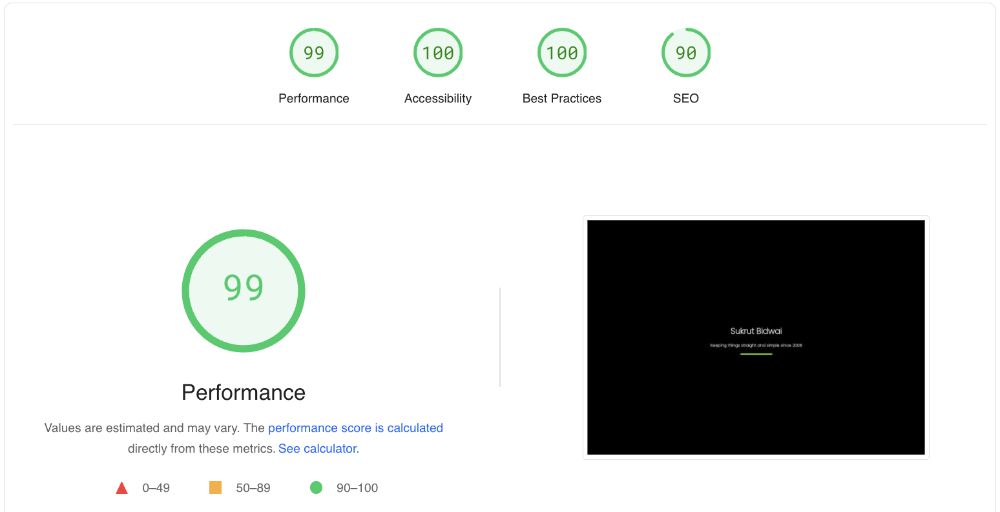

# Personal Portfolio Website

## Technologies used:
  ```
  1. HTML
  2. CSS
  3. JAVASCRIPT
```

## Link for quick access: 
  ```
  https://sbidwaibing.github.io/SukrutB
  ```
## Google PageSpeed Insights Achieved



  ```
  Model: Desktop Version |
  Best Suited with Safari, Google Chrome, Brave, Mozilla Firefox

  METRICS
--

  First Contentful Paint: 0.7 seconds
  First Contentful Paint marks the time at which the first text or image is painted.
  
  Largest Contentful Paint: 0.9 seconds
  The largest Contentful Paint marks the time at which the largest text or image is painted. 
  
  Total Blocking Time: 0 milli-seconds
  The sum of all periods between FCP and Time to Interactive, when task length exceeded 50ms, expressed in milliseconds.
  
  Cumulative Layout Shift: 0 seconds
  Cumulative Layout Shift measures the movement of visible elements within the viewport.
  
  Speed Index: 0.7 seconds
  Speed Index shows how quickly the contents of a page are visibly populated.
  ```
